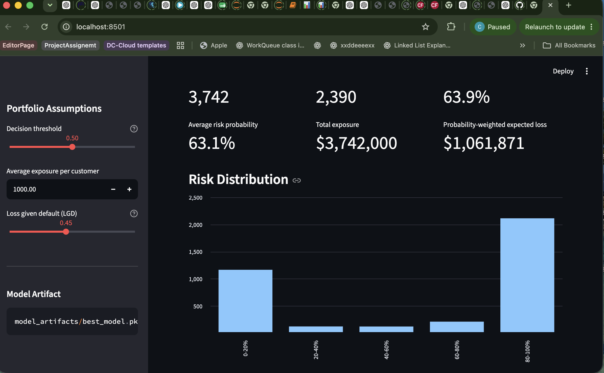
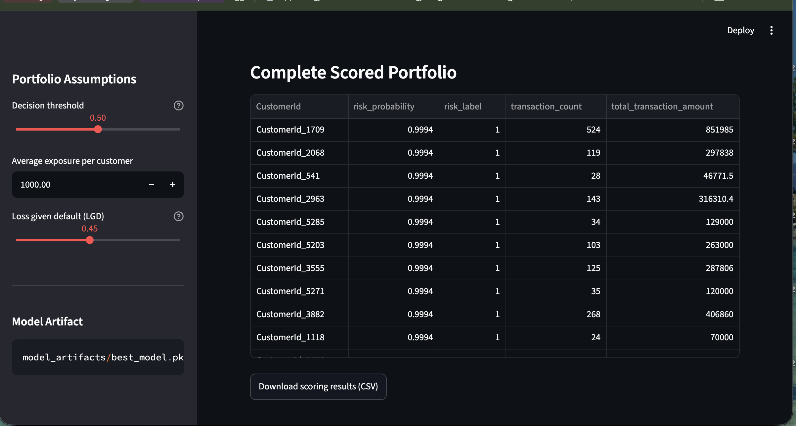

# Credit Risk Probability Model for Alternative Transaction Data

[](https://github.com/rediet-shewarega/credit-risk-model/actions/workflows/ci.yml)                   
A production-oriented credit-risk scoring project that converts raw ecommerce transactions into customer-level risk estimates. The project includes reproducible model training, automated tests, continuous integration, model persistence, and an interactive Streamlit portfolio dashboard.

> **Important:** The model uses an RFM-based proxy target rather than verified loan-default outcomes. Its predictions should support—not replace—human underwriting decisions and formal credit policy.

## Business Problem

Financial institutions need reliable ways to assess customers who have limited conventional credit histories. Alternative transaction data can provide useful behavioural signals, including:

- How recently a customer completed a transaction
- How frequently the customer transacts
- The total and average transaction value
- Transaction channel and product behaviour
- Patterns indicating customer activity or disengagement

The objective is to convert these signals into transparent customer-level risk probabilities that can support portfolio monitoring and credit review.

## Solution Overview

The project implements an end-to-end machine-learning workflow:

1. Validate raw transaction data.
2. Convert timestamps into a consistent UTC timezone.
3. Aggregate transaction-level records into customer-level features.
4. Generate an RFM-based proxy risk target.
5. Train and compare classification pipelines.
6. Select the best model using cross-validation and ROC-AUC.
7. Record parameters and metrics with MLflow.
8. Save a reusable model artifact.
9. Score uploaded transactions through an interactive Streamlit dashboard.
10. Run automated tests and linting through GitHub Actions.

## Key Features

- Modular Python project structure
- Type hints and documented functions
- Configuration through a frozen dataclass
- Reusable raw-transaction transformation pipeline
- Automated hyperparameter tuning with `GridSearchCV`
- MLflow experiment tracking
- Serializable end-to-end model artifact
- Configurable credit-risk decision threshold
- Finance-focused Streamlit dashboard
- Portfolio risk distribution and customer-level results
- Expected-loss estimation using exposure and LGD assumptions
- Automated unit and integration tests
- GitHub Actions continuous integration
- Clear disclosure of proxy-target and model limitations

## Reliability and Risk Controls

The project includes several controls that are important for financial applications:

- **Schema validation:** Required transaction columns are checked before scoring.
- **Timestamp consistency:** Transaction and snapshot dates are normalized to UTC.
- **Reproducibility:** Training settings are stored in a configuration dataclass.
- **Model persistence:** The full preprocessing and prediction workflow is serialized.
- **Testing:** Unit and integration tests verify data processing, training, prediction, serialization, and dashboard calculations.
- **Continuous integration:** Every push to the Week 12 branch runs linting and automated tests.
- **Human oversight:** Dashboard output is presented as decision support rather than automatic approval or rejection.
- **Transparent limitation:** The target is an RFM-derived proxy and is not a verified default label.

## Verified Engineering Results

At the latest local validation:

- **18 automated tests passed**
- **Flake8 quality checks passed**
- **GitHub Actions CI passed**
- **End-to-end model training and serialization completed**
- **The trained model can score uploaded raw transaction data**
- **The dashboard provides configurable portfolio-risk assumptions**

These are engineering reliability results. They should not be interpreted as evidence of real-world lending performance until the model is validated using verified repayment or default outcomes.

## Project Structure

```text
credit-risk-model/
├── .github/
│   └── workflows/
│       └── ci.yml
├── data/
│   └── training.csv              # Local only; excluded from Git
├── docs/
│   ├── gap_analysis.md
│   └── images/
├── model_artifacts/
│   └── best_model.pkl            # Generated locally; excluded from Git
├── notebooks/
│   └── eda.ipynb
├── src/
│   ├── api/
│   ├── __init__.py
│   ├── dashboard.py
│   ├── data_processing.py
│   ├── model.py
│   ├── predict.py
│   └── train.py
├── tests/
│   ├── test_dashboard.py
│   ├── test_data_processing.py
│   ├── test_model_roundtrip.py
│   ├── test_prediction.py
│   └── test_training.py
├── app.py
├── Dockerfile
├── docker-compose.yml
├── README.md
└── requirements.txt
```

## Data

The project uses transaction data from the [Xente Fraud Detection Challenge](https://zindi.africa/competitions/xente-fraud-detection-challenge).

The dataset is not committed to this repository. After downloading and extracting the competition archive, place the training file at:

```text
data/training.csv
```

Users must comply with the dataset provider’s access conditions and licensing terms.

## Quick Start

### 1. Clone the repository

```bash
git clone https://github.com/rediet-shewarega/credit-risk-model.git
cd credit-risk-model
git checkout week12-production-upgrade
```

### 2. Create a virtual environment

```bash
python3 -m venv .venv
source .venv/bin/activate
```

On Windows:

```bash
.venv\Scripts\activate
```

### 3. Install dependencies

```bash
python -m pip install --upgrade pip
pip install -r requirements.txt
```

### 4. Add the dataset

Create the local data directory and copy the downloaded training data:

```bash
mkdir -p data
cp /path/to/training.csv data/training.csv
```

### 5. Train the model

```bash
python -m src.train \
  --data data/training.csv \
  --output-dir model_artifacts
```

The selected model will be saved as:

```text
model_artifacts/best_model.pkl
```

### 6. Launch the dashboard

```bash
python -m streamlit run app.py
```

Open the displayed local address, normally:

```text
http://localhost:8501
```

Upload `data/training.csv` through the **Transaction CSV** uploader to generate portfolio results.

## Dashboard

The dashboard allows a stakeholder to:

- Upload raw transaction records
- Adjust the risk decision threshold
- Set average exposure per customer
- Set loss given default
- Review the number and percentage of high-risk customers
- Inspect customer-level probabilities and classifications
- Review portfolio risk distributions
- Estimate exposure and expected loss under stated assumptions
- Download scoring results for further analysis

### Portfolio Overview



### Customer-Level Risk Results



## Running Tests

Run the complete automated test suite:

```bash
python -m pytest -q
```

Run code-quality checks:

```bash
python -m flake8 src tests app.py
```

The test suite covers:

- Required-column validation
- Transaction aggregation
- Risk prediction behaviour
- Decision-threshold behaviour
- Empty-input handling
- Model serialization and loading
- Training configuration
- Training-pipeline structure
- End-to-end model training
- Dashboard KPI calculations
- Dashboard sample-data generation

## Continuous Integration

The GitHub Actions workflow runs automatically on pushes to:

- `main`
- `week12-production-upgrade`

The workflow:

1. Checks out the repository.
2. Configures Python 3.11.
3. Installs project dependencies.
4. runs Flake8.
5. runs the complete pytest suite.

Workflow configuration:

```text
.github/workflows/ci.yml
```

## Technical Details

### Feature Engineering

Raw transactions are aggregated into customer-level behavioural features, including:

- Total transaction amount
- Average transaction amount
- Transaction-value variation
- Transaction count
- Recency
- Frequency
- Monetary value
- Relevant categorical behaviour

### Target Construction

Because the dataset does not provide verified credit-default outcomes, the project creates an RFM-based proxy target. This makes experimentation possible, but introduces an important limitation: customer engagement patterns are not equivalent to actual loan repayment behaviour.

### Model Training

The training workflow uses:

- Scikit-learn pipelines
- Numerical imputation and scaling
- Categorical imputation and one-hot encoding
- Multiple classification candidates
- `GridSearchCV`
- ROC-AUC model selection
- MLflow parameter and metric tracking

### Evaluation

ROC-AUC is used during model selection because it evaluates ranking quality across classification thresholds. For real-world lending deployment, additional evaluation would be required, including:

- Precision and recall
- Calibration
- Confusion matrix at the policy threshold
- Population stability
- Fairness testing
- Performance by customer segment
- Back-testing against verified repayment outcomes

## Business Impact

The project demonstrates how a financial institution could transform raw transaction data into a repeatable risk-monitoring workflow.

Potential benefits include:

- Faster initial customer-risk review
- Consistent application of scoring logic
- Earlier identification of potentially high-risk customers
- Transparent portfolio-risk summaries
- Configurable scenario analysis
- Reduced manual aggregation effort
- Improved auditability through tests, CI, configuration, and documented assumptions

Any financial-loss estimates shown by the dashboard are scenario estimates based on user-provided exposure and LGD assumptions. They are not realized savings or audited financial results.

## Model Governance and Limitations

Before production use, the following controls would be required:

- Replace the proxy target with verified repayment or default labels.
- Validate performance on out-of-time data.
- Measure probability calibration.
- Review model performance across protected and vulnerable groups.
- Establish approval, override, and escalation policies.
- Monitor feature drift and prediction drift.
- Record model versions and approval history.
- Restrict access to sensitive customer information.
- Perform independent model-risk validation.

## Future Improvements

- Add SHAP-based global and local explanations
- Validate against verified repayment outcomes
- Add fairness and subgroup-performance reporting
- Add probability calibration
- Add drift and stability monitoring
- Deploy the dashboard to a secure hosted environment
- Add API authentication and authorization
- Add structured application logging
- Add test-coverage reporting
- Add automated model-validation reports

## Documentation


- [Week 12 Gap Analysis and Improvement Plan](docs/gap_analysis.md)
- [Final Technical Report](docs/credit-risk-final-report.pdf)

## Responsible Use

This project is intended for educational and portfolio purposes. It must not be used as the sole basis for making real credit decisions. Any production implementation should include verified labels, appropriate legal and regulatory review, security controls, fairness assessment, explainability, monitoring, and qualified human oversight.

## Author

**Rediet Shewarega**

- GitHub: [rediet-shewarega](https://github.com/rediet-shewarega)
